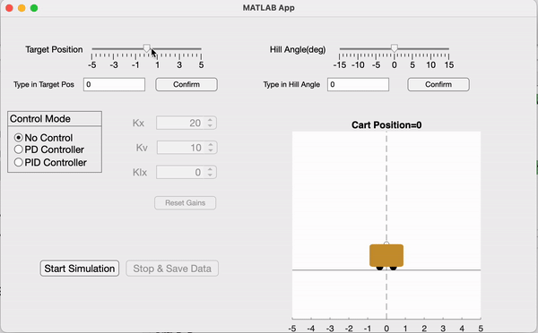
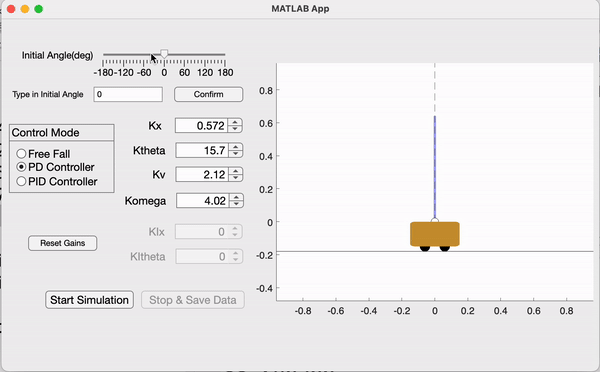

# ES155Lab
The simulation code repo for ES155.

## Cruise Control Example

## Cart Inverted Pendulum Example

## Cruise Control Quick Start

Start Matlab.

Change folder to the root directory of CruiseControl/runapp.m

Run runapp.m

Initially, the cart situates at position=0.

You may change the slope of the ground by dragging the slider bar at the top, or type in the initial value in the box beneath the slider and press "Confirm". The change in the slope of the ground will be reflected in the animation of the cart.

You may change the target position to reach similarly through the corresponding slider or the value box beneath. The change in target position will be reflected through the change of the blue dotted vertical line in the animation.

Click "Start Simulation" button to start the simulation. The button will be pressed down and its text changes to "Press to Pause". Press the same button again to pause the simulation.

Click "Stop & Save Data" to stop the simulation and reset the cart to the default state. The plot of the history data for the simulation will be displayed, and the corresponding data is saved in 'sim-data-xxx.mat'.

By default, the proportional controller is disabled, the system is in "No Control" mode.

Select the radio button "PD Controller" in the "Control Mode" block to enable proportional controller.

The default gains of the PD Controller is a stablizing controller for small deviation from the equilibrium point.

Similar, select the radio button of "PID Controller" to use PID control. By default, the integration part is disabled.

You may type in or click on the up/down button to change the gain for each of the controller gain.

You may click "Reset Gains" button to reset the gains to the default stablizing controller.

Information about the system dynamics can be found in "Cruise Control System Dynamics.png" as well as the stateTransFunc() in cruise_control_model.m

## Cart Inverted Pendulum Quick Start

Start Matlab.

Change folder to the root directory of CartInvertedPendulum/runapp.m

Run runapp.m

You may change the initial angle of the pendulum by dragging the slider bar at the top, or type in the initial value in the box beneath the slider and press "Confirm".

Click "Start Simulation" button to start the simulation. The button will be pressed down and its text changes to "Press to Pause". Press the same button again to pause the simulation.

Click "Stop & Save Data" to stop the simulation and reset the cart to the default state. The plot of the history data for the simulation will be displayed, and the corresponding data is saved in 'sim-data-xxx.mat'.

By default, the proportional controller is disabled, the system is in "Free Fall" mode.

Select the radio button "PD Controller" in the "Control Mode" block to enable proportional controller.

The default gains of the PD Controller is a stablizing controller for small deviation from the equilibrium point.

Similar, select the radio button of "PID Controller" to use PID control. By default, the integration part is disabled.

You may type in or click on the up/down button to change the gain for each of the controller gain.

You may click "Reset Gains" button to reset the gains to the default stablizing controller.

Information about the system dynamics can be found in cartinvertedpendulum_derivation.pdf as well as the stateTransFunc() in cart_inverted_model.m
